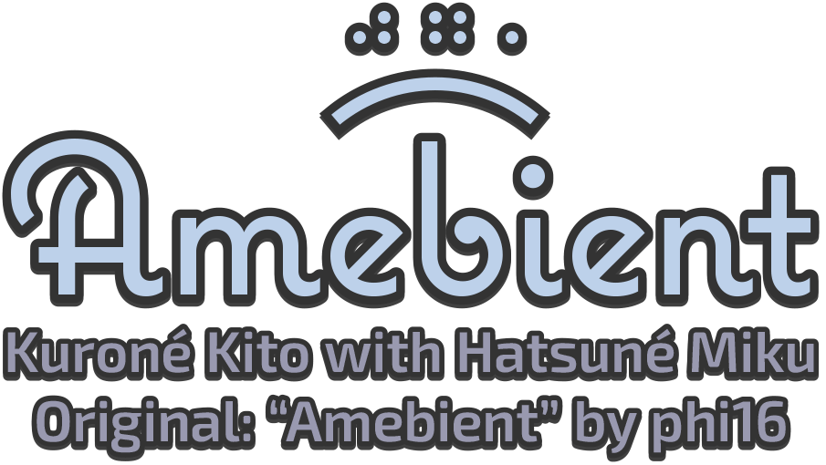

# 💿 [ボカロ曲 “Amebient”](https://youtu.be/2dqjAGQQmpw) のリソース

## 歌詞

- [SubViewer 形式の歌詞ファイル](https://github.com/kurone-kito/amebient/raw/main/texts/lyrics.sbv)

```txt
泡の中漂う 夢の国ここにある
水の中光る雪 未来への扉

青い世界見下ろして 音の波広がるよ
心の声呼んでいる 探す旅始まる

空に溶ける星の道 歩いてくよ一人で
水に沈む思い出 壊れた世界愛して

キラキラの魚たち 踊るように泳いでる
静かな声囁いて 新しい朝が来る

刻の流れゆっくりと 夢の中独りぼっち
壊れたけど温かい 未来へと紡がれてく道

空に溶ける星の道 歩いてくよ一人で
水に沈む思い出 壊れた世界愛して
```

## サウンド関係

### Amebient の音楽データ

ぜひ、あなたのスマホのボカロプレイリストへ！

- 41MB: [【ロスレス】Apple Lossless (ALAC M4A)](https://github.com/kurone-kito/amebient/raw/main/sounds/amebient.alac.m4a)
- 40MB: [【ロスレス】Free Lossless Audio Codec (FLAC)](https://github.com/kurone-kito/amebient/raw/main/sounds/amebient.flac)
- 14MB: [MPEG Audio layer-3 (MP3)](https://github.com/kurone-kito/amebient/raw/main/sounds/amebient.mp3)

### Instrumental (カラオケ)

歌みた向けのボカロなし版です。

- 38MB: [【ロスレス】Apple Lossless (ALAC M4A)](https://github.com/kurone-kito/amebient/raw/main/sounds/instrument.alac.m4a)
- 38MB: [【ロスレス】Free Lossless Audio Codec (FLAC)](https://github.com/kurone-kito/amebient/raw/main/sounds/instrument.flac)

## 画像関係

### ロゴ

|                                             クレジットなし                                              |                                                               クレジット付き                                                                |
| :-----------------------------------------------------------------------------------------------------: | :-----------------------------------------------------------------------------------------------------------------------------------------: |
| [](https://github.com/kurone-kito/amebient/raw/main/images/logo.png) | [](https://github.com/kurone-kito/amebient/raw/main/images/logo-with-credit.png) |

#### 使用フォント

- ロゴ
  - [Coquette Regular](https://fonts.adobe.com/fonts/coquette)
  - [Exo 2 Semibold](https://fonts.google.com/specimen/Exo+2)
- 歌詞
  - [イワタ明朝体オールド](https://www.iwatafont.co.jp/font/omin.html)

### ジャケット

|                                                                       ロゴなし                                                                       |                                                   ロゴ付き                                                    |
| :--------------------------------------------------------------------------------------------------------------------------------------------------: | :-----------------------------------------------------------------------------------------------------------: |
| [](https://github.com/kurone-kito/amebient/raw/main/images/jacket-without-logo.png) | [](https://github.com/kurone-kito/amebient/raw/main/images/jacket.png) |

## ライセンス

ここにあるコンテンツは全て、
[CC-BY-NC-4.0](https://creativecommons.org/licenses/by-nc/4.0/deed.ja)
ライセンスの下で提供しております。

非商用目的で、かつ出典の明記のみお守りいただければ、
無制限のご利用がいただけます。
